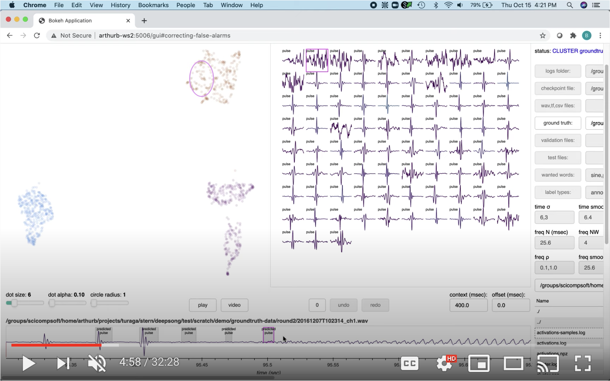
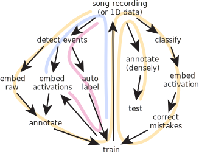

Table of Contents
=================

   * [Description](#description)
   * [Public Domain Annotations](#public-domain-annotations)
   * [Citations and Repositories](#citations-and-repositories)
   * [Notation](#notation)
   * [Installation](#installation)
      * [Downloading Executables](#downloading-executables)
      * [System Configuration](#system-configuration)
      * [Scheduling Jobs](#scheduling-jobs)
         * [Locally](#locally)
         * [Another Workstation](#another-workstation)
         * [An On-Premise Cluster](#an-on-premise-cluster)
   * [Tutorial](#tutorial)
      * [Detecting Sounds](#detecting-sounds)
      * [Manually Annotating](#manually-annotating)
      * [Training a Classifier](#training-a-classifier)
      * [Quantifying Accuracy](#quantifying-accuracy)
      * [Making Predictions](#making-predictions)
      * [Correcting False Alarms](#correcting-false-alarms)
      * [Correcting Misses](#correcting-misses)
      * [Minimizing Annotation Effort](#minimizing-annotation-effort)
      * [Double Checking Annotations](#double-checking-annotations)
      * [Measuring Generalization](#measuring-generalization)
      * [Searching Hyperparameters](#searching-hyperparameters)
      * [Limiting Ground Truth](#limiting-ground-truth)
      * [Examining Errors](#examining-errors)
      * [Ensemble Models](#ensemble-models)
      * [Transfer Learning](#transfer-learning)
      * [Testing Densely](#testing-densely)
      * [Discovering Novel Sounds](#discovering-novel-sounds)
      * [Overlapped Classes](#overlapped-classes)
      * [Unsupervised Methods](#unsupervised-methods)
      * [Scripting Automation](#scripting-automation)
   * [Training on Video](#training-on-video)
   * [Customizing with Plug-ins](#customizing-with-plug-ins)
      * [Loading Data](#loading-data)
      * [Video Filenames](#video-filenames)
      * [Event Detection](#event-detection)
      * [Double-Click Annotations](#double-click-annotations)
      * [Network Architecture](#network-architecture)
      * [Clustering Algorithm](#clustering-algorithm)
   * [Troubleshooting](#troubleshooting)
   * [Frequently Asked Questions](#frequently-asked-questions)
   * [Reporting Problems](#reporting-problems)
   * [Development](#development)
      * [Conda](#conda)
      * [Singularity](#singularity)
      * [Docker](#docker)
      * [System Tests](#system-tests)

# Description #

You have an audio recording, and you want to know where certain classes of
sounds are.  SongExplorer is trained to recognize such words by manually giving
it a few examples.  It will then automatically calculate the probability,
over time, of when those words occur in all of your recordings.

Alternatively, you have two or more sets of audio recordings, and you want to
know if there are differences between them.  SongExplorer can automatically
detect sounds in those recordings and cluster them based on how well it
can distinguish between them.

Applications suitable for SongExplorer include quantifying the rate or pattern
of words emitted by a particular species, distinguishing a recording of one
species from another, and discerning whether individuals of the same species
produce different song.

Underneath the hood is a deep convolutional neural network.  The input is the
raw audio stream, and the output is a set of mutually-exclusive probability
waveforms corresponding to each word of interest.

Training begins by first thresholding one of your recordings in the time- and
frequency-domains to find sounds that exceed the ambient noise.  These sounds
are then clustered based on similarities in the waveforms for you to manually
annotate with however many word labels naturally occur.  A classifier is
then trained on this corpus of ground truth, and a new recording is analyzed
by it.  The words it automatically finds are then clustered, this time using
the activations of the hidden neurons, and displayed with predicted labels.
You manually correct the mistakes, both re-labeling words that it got wrong,
as well as labeling words it missed.  These new annotations are added to the
ground truth, and the process of retraining the classifier and analyzing and
correcting new recordings is repeated until the desired accuracy is reached.

# Public Domain Annotations #

SongExplorer is open source and free for you to use.  However, SongExplorer is not
a static piece of software.  It’s performance is improved with additional
high-quality annotations.

Therefore, when you publish results based on SongExplorer, we request that you make
all of your primary data and annotations freely available in a recognized data
repository, such as [figshare](http://figshare.com),
[Dryad](http://datadryad.org), or [Zenodo](http://zenodo.org).  Many journals
already require deposition of raw data, but we strongly encourage you to also
provide your manual annotations.  These manual annotations will serve to
improve the performance of SongExplorer over time, helping both your own work and
that of everyone else.

Please let us know where you have deposited your raw
data and annotations by posting an issue to the [SongExplorer
repository](https://github.com/JaneliaSciComp/SongExplorer).  We will endeavor to
maintain a list of these recordings and annotations in the
[Citations and Repositories](#citations-and-repositories) section below.

In addition, consider donating your recordings to a library or museum, like the
Cornell Lab of Ornithology's [Macauley Library](www.macaulaylibrary.org) or the
Museo de Ciencias Naturales de Madrid's [Fonoteca Zoológica](www.fonozoo.com).

Publishing your trained models too is also useful to others, for reproducibility
at a minimum but also as an example of what hyperparameters work well.  Simply
compress the entire "logs folder" along with the ".pb" folder inside containing
the learned parameters (see [Making Predictions](#making-predictions) below).
Be sure to use `delete-ckpts` to reduce its footprint on disk before
distributing it to others.

As an alternative, a list of hyperparameters could suffice, but only if it is
complete.  At least the following should be included:  the length of the context
window, a description of each layer including the kernel size, the number of
feature maps, strides and dilations if it is convolutional, the type of
non-linearity used (e.g. ReLU), whether and where dropout and batch
normalization were used, the batch size, the learning rate, the optimizer, the
number of training steps, the fraction of data withheld for validation, the
version of songexplorer used, the number of trainable parameters (as a sanity
check), and, for the curious, the wall clock time that training took and the
hardware used (e.g. GPU make and model).

# Citations and Repositories

Lee S (2024)
Studying Aphid feeding behavior using the Electrical Penetration Graph
Janelia Meyerhoff Undergraduate Scholars Symposium

D Ye, JT Walsh, IP Junker, Y Ding (2024)
Changes in the cellular makeup of motor patterning circuits drive courtship song evolution in Drosophila
[bioRxiv](https://www.biorxiv.org/content/10.1101/2024.01.23.576861v1.full)

T Wiesner (2023)
How good is SongExplorer, a machine learning based classifier, at recognising the electrical signals of Apteronotus leptorhynchus?
Bachelor's Thesis, Humboldt Universitat zu Berlin

HM Shiozaki, K Wang, JL Lillvis, M Xu, BJ Dickson, DL Stern (2023)
Activity of nested neural circuits drives different courtship songs in Drosophila
[Nat. Neurosci.](https://doi.org/10.1038/s41593-024-01738-9) [bioRxiv](https://www.biorxiv.org/content/10.1101/2022.12.14.520499v2.full)

JL Lillvis, K Wang, HM Shiozaki, M Xu,  DL Stern, BJ Dickson (2023)
Nested neural circuits generate distinct acoustic signals during Drosophila courtship
[Current Biology](https://www.cell.com/current-biology/fulltext/S0960-9822%2824%2900015-0) [bioRxiv](https://www.biorxiv.org/content/10.1101/2023.08.30.555537v2.abstract)  [figshare](https://doi.org/10.25378/janelia.24707544)

JL Lillvis, H Otsuna, X Ding, I Pisarev, T Kawase, J Colonell, K Rokicki, C Goina, R Gao, A Hu, K Wang, J Bogovic, DE Milkie, L Meienberg, BD Mensh, ES Boyden, S Saalfeld, PW Tillberg, BJ Dickson  (2022)
Rapid reconstruction of neural circuits using tissue expansion and light sheet microscopy
[eLife](https://elifesciences.org/articles/81248) [bioRxiv](https://www.biorxiv.org/content/10.1101/2021.11.14.468535v2.abstract)

BJ Arthur, Y Ding, M Sosale, F Khalif, E Kim, P Waddell, S Turaga, DL Stern (2021)  
*SongExplorer*: A deep learning workflow for discovery and segmentation of animal acoustic communication signals  
[bioRxiv](https://www.biorxiv.org/content/10.1101/2021.03.26.437280v1)  [figshare](https://figshare.com/articles/dataset/Audio_recordings_of_21_species_of_Drosophila_10_of_which_are_annotated/14328425)

# Notation #

Throughout this document `Buttons` and `variables` in the SongExplorer graphical
user interface (GUI) as well as `code` are highlighted with backticks.  Files and
paths are enclosed in double quotes ("...").  The dollar sign ($) in code
snippets signifies your computer terminal's command line.  Square brackets
([...]) in code indicate optional components, and angle brackets (<...>)
represent sections which you much customize.

# Installation #

SongExplorer can be run on all three major platforms.  Installation is as simple
as downloading a compressed binary file, unpacking it, and opening a file.  If
you have a Linux distribution other than Ubuntu, then you might need to use a
container (e.g. Docker), as Tensorflow, the machine learning framework from
Google that SongExplorer uses, only supports Ubuntu.

Training your own classifier is fastest with a graphics processing unit (GPU).
On Linux and Windows you'll need to install the CUDA and CUDNN drivers from
nvidia.com.  The latter requires you to register for an account.  SongExplorer
was tested and built with version 12.1.  On Macs with Apple silicon processors
(i.e. the M series chips), the integrated GPU is accessed via the Metal
framework, which comes preinstalled on MacOS.

## Downloading Executables ##

Download the ZIP file specific to your operating system from the Assets
section of Songexplorer's
[Releases](https://github.com/JaneliaSciComp/SongExplorer/releases) page on
Github.  Then extract its contents, by either right-clicking on the icon, or
executing this command in a terminal:

    $ unzip songexplorer-<version>-<architecture>.zip

If there are multiple ZIP files ending in a three digit number, download them
all and use a decompression program (e.g. 7-zip on MS Windows) that can
automatically glue them back together.  Github has a 2 GB limit on file size
and so sometimes ZIP files must be split.

If on MS Windows you get an error about file paths being too long, edit the
registry as follows:  press Start and type "regedit" to launch the
RegistryEditor, in the left sidebar navigate to "HKEY_LOCAL_MACHINE \ SYSTEM \\
CurrentControlSet \ Control \ FileSystem", on the right double-click on
"LongPathsEnabled", change the value to "1", press Ok, sign out of your account
and then back in, and try to decompress again making sure to use 7-zip.

If on MS Windows you get a permissions error when running SongExplorer, execute
the following in PowerShell:

    > Set-ExecutionPolicy -ExecutionPolicy RemoteSigned -Scope CurrentUser

## System Configuration ##

SongExplorer is capable of training a classifier and making predictions on
recordings either locally on the host computer, or remotely on a workstation or
a cluster.  You specify how you want this to work by editing "configuration.py".

Inside you'll find many variables which control where SongExplorer does its work:

    $ grep _where= configuration.py
    default_where="local"
    detect_where=default_where
    misses_where=default_where
    train_where=default_where
    generalize_where=default_where
    xvalidate_where=default_where
    mistakes_where=default_where
    activations_where=default_where
    cluster_where=default_where
    accuracy_where=default_where
    freeze_where=default_where
    classify_where=default_where
    ethogram_where=default_where
    compare_where=default_where
    congruence_where=default_where

Each operation (e.g. detect, train, classify, generalize, etc.) is dispatched
according to these `_where` variables.  SongExplorer is shipped with each set to
"local" via the `default_where` variable at the top of the configuration file.
This value instructs SongExplorer to perform the task on the same machine as used
for the GUI.  You can change which computer is used to do the actual work
either globally through this variable, or by configuring the operation specific
ones later in the file.  Other valid values for these variables are "server"
for a remote workstation that you can `ssh` into, and "cluster" for an
on-premise Beowulf-style cluster with a job scheduler.

Note that "configuration.py" must be a valid Python file.

## Scheduling Jobs ##

Irrespective of where you want to perform your compute, there are additional
variables that need to be tailored to your specific resources.

### Locally ###

When running locally SongExplorer uses a custom job scheduler,
[aitch](https://github.com/JaneliaSciComp/aitch), to manage the
resources required by different tasks.  Scheduling permits doing multiple
jobs at once, as well as queueing a bunch of jobs for offline analysis.  By
default, each task reserves all of your computer's CPU cores, GPU cards, and
memory, and so only one job can be run at a time.  To tailor resources according
to your particular data set, and thereby permit multiple jobs to be run
simultaneously, you need to specify for each kind of task how much of the
system's resources are actually required.

Here, for example, are the default settings for training a model locally:

    $ grep train_ configuration.py | head -4
    train_where=default_where
    train_ncpu_cores=-1
    train_ngpu_cards=-1
    train_ngigabytes_memory=-1

Let's break this down.  The variables ending in ncpu_cores, ngpu_cards, and
ngigabytes_memory specify, respectively, the number of CPU cores, number of GPU
cards, and number of gigabytes of memory needed, with -1 reserving everything
available.  For the model in the [Tutorial](#tutorial) below, this is way
overkill, even on the most humble computer, as training only uses two CPU cores
and a gigabyte of memory.  So in this case you could set
`train_{ncpu_cores,ngpu_cards,ngigabytes_memory}` to 2, 0, and 1, respectively.
Doing so would then permit you to train multiple models at once.  Alternatively,
if you have a GPU, you could set
`train_{ncpu_cores,ngpu_cards,ngigabytes_memory}` to 2, 1, and 1 for this
network architecture.  As it happens though, training is quicker *without* a GPU
for this model.  Moreover, were these latter settings used on a machine with
just one GPU, you could only train one model at a time.

Note that these settings don't actually limit the job to that amount of
resources, but rather they just limit how many jobs are running simultaneously.
It is important not to overburden your computer with tasks, so don't
underestimate the resources required, particularly memory consumption.  To make
an accurate assessment for your particular workflow, use the `top` and
`nvidia-smi` commands on Unix, the Task Manager on Windows, or the Activity
Monitor on Macs to monitor jobs while they are running.

    $ top
    top - 09:36:18 up 25 days,  1:18,  0 users,  load average: 11.40, 12.46, 12.36
    Tasks: 252 total,   1 running, 247 sleeping,   0 stopped,   4 zombie
    %Cpu(s):  0.7 us,  0.9 sy, 87.9 ni, 10.4 id,  0.1 wa,  0.0 hi,  0.0 si,  0.0 st
    KiB Mem : 32702004 total,  3726752 free,  2770128 used, 26205124 buff/cache
    KiB Swap: 16449532 total, 16174964 free,   274568 used. 29211496 avail Mem 

      PID USER      PR  NI    VIRT    RES    SHR S  %CPU %MEM     TIME+ COMMAND
    21124 arthurb   20   0 55.520g 2.142g 320792 S 131.2  6.9   1:38.17 python3
        1 root      20   0  191628   3004   1520 S   0.0  0.0   1:20.57 systemd
        2 root      20   0       0      0      0 S   0.0  0.0   0:00.33 kthreadd

The output above shows that a `python3` command, which is how a training session
appears, is currently using 131.2% of a CPU core (e.g. 1.3 cores), and 6.9% of
the 32702004 KiB of total system memory (so about 2.15 GiB).

Use the `nvidia-smi` command to similarly monitor the GPU card.  The same
`python3` command as above is currently using 4946 MiB of GPU memory and 67% of
the GPU cores.  Use the `watch` command to receive repeated updates (i.e.
`watch nvidia-smi`).

    $ nvidia-smi
    Fri Jan 31 09:35:13 2020       
    +-----------------------------------------------------------------------------+
    | NVIDIA-SMI 418.39       Driver Version: 418.39       CUDA Version: 10.1     |
    |-------------------------------+----------------------+----------------------+
    | GPU  Name        Persistence-M| Bus-Id        Disp.A | Volatile Uncorr. ECC |
    | Fan  Temp  Perf  Pwr:Usage/Cap|         Memory-Usage | GPU-Util  Compute M. |
    |===============================+======================+======================|
    |   0  GeForce GTX 980 Ti  Off  | 00000000:03:00.0 Off |                  N/A |
    | 22%   65C    P2   150W / 250W |   4957MiB /  6083MiB |     67%      Default |
    +-------------------------------+----------------------+----------------------+
                                                                                   
    +-----------------------------------------------------------------------------+
    | Processes:                                                       GPU Memory |
    |  GPU       PID   Type   Process name                             Usage      |
    |=============================================================================|
    |    0     21124      C   /usr/bin/python3                            4946MiB |
    +-----------------------------------------------------------------------------+

### Another Workstation ###

Using a lab or departmental server, or perhaps a colleague's workstation
remotely, is easiest if you run SongExplorer on it directly and then view the GUI
in your own personal workstation's internet browser.  To do this, simply `ssh`
into the server and install SongExplorer as described above.

Alternatively, you can run the GUI code (in addition to viewing its output) on
your own personal workstation and batch compute jobs to the remote server.
This is easiest if there is a shared file system between the two computers.
The advantage here is that less compute intensive jobs (e.g. freeze, accuracy)
can be run on your workstation.  In this case:

* Store all SongExplorer related files on the share, including the uncompressed
ZIP file or container image, "configuration.py", and all of your data.

* Set the PATH environment variable on the remote machine, either directly or by
specifying it in `SONGEXPLORER_BIN` as follows.

On MacOS (and Linux), put this definition in your .bashrc file:

    export SONGEXPLORER_BIN='PATH=<path-to-unzipped-executable>/songexplorer/bin:$PATH'

For MS Windows, the equivalent is, in a PowerShell terminal with administrator
privileges:

    > $tbpath="<path-to-unzipped-executable>"
    > [Environment]::SetEnvironmentVariable("SONGEXPLORER_BIN",
            $tbpath + ";" +
            $tbpath + "\bin\songexplorer\src;" +
            $tbpath + "\Library\mingw-w64\bin;" +
            $tbpath + "\Library\usr\bin;" +
            $tbpath + "\Library\bin;" +
            $tbpath + "\Scripts;" +
            $tbpath + "\bin;",
            [EnvironmentVariableTarget]::Machine)
    > [Environment]::SetEnvironmentVariable("Path",
            $env:SONGEXPLORER_BIN + $env:Path,
            [EnvironmentVariableTarget]::Machine)

* Make the remote and local file paths match by creating a symbolic link.
For example, if on a Mac you use SMB to mount as "/Volumes/MyLab" an NSF
drive whose path is "/groups/MyLab", then add `-[v|B] /groups/MyLab`
to `SONGEXPLORER_BIN` and `mkdir -p /groups && ln -s /Volumes/MyLab/
/groups/MyLab`.  With Docker you'll additionally need to open the preferences
panel and configure file sharing to bind "/groups".

* Set the `SONGEXPLORER_BIN` environment variable plus the `songexplorer` alias
on both your workstation and the server to point to this same image.

* You might need an RSA key pair.  If so, you'll need to add `-[v|B]
~/.ssh:/root/.ssh` to `SONGEXPLORER_BIN`.

* You might need to use ssh flags `-i /ssh/id_rsa -o "StrictHostKeyChecking
no"` in "configuration.py".

If you do not have a shared file system, the SongExplorer image and
configuration file must be separately installed on both computers, and
you'll need to do all of the compute jobs remotely.

Lastly, update "configuration.py" with the name of the user and IP
address of the server.  As when doing compute locally, SongExplorer
uses a job scheduler on the server to manage resources.  The per-task
resources used are the same as specified for the local machine in
`<task>_{ncpu_cores,ngpu_cards,ngigabytes_memory}`.

    $ grep -A2 \'server configuration.py
    # URL of the 'server' computer
    server_username="arthurb"
    server_ipaddr="c03u14.int.janelia.org"

### An On-Premise Cluster ###

Submitting jobs to a cluster is similar to using a remote workstation, so read
the above section first.  You might want to even try batching to a another
workstation first, as it can be easier to debug problems than doing so on a
cluster.

You use your own workstation to view the GUI in a browser, and can either run
the GUI code locally or on the cluster.  With the former you have the option to
submit only a portion of the compute jobs to the cluster, whereas with the
latter they must all be performed by the cluster.  Running the GUI code on the
cluster also requires that the cluster be configured to permit hosting a web
page.  Moreover, if your cluster charges a use fee, you'll be charged even when
the GUI is sitting idle.

As before, it is easiest if there is a shared file system, and if so, all files
need to be on it, and the local and remote file paths must be the same or made
to be the same with links.  The environment variables and aliases must also be
the same.

You'll likely need an RSA key pair, possibly need special `ssh` flags, and
definitely need to specify the IP address of the head node and corresponding
job submission command and its flags.  The best person to ask for help here is
your system administrator.

    $ grep -A4 \'cluster configuration.py
    # specs of the 'cluster'
    cluster_username="arthurb"
    cluster_ipaddr="login1"
    cluster_cmd="bsub -Ne -Pmylab"
    cluster_logfile_flag="-oo"

The syntax used to specify the resources required is unique to the particular
scheduler your cluster uses and how it is configured.  SongExplorer was
developed and tested using the Load Sharing Facility (LSF) from IBM.  To support
any cluster scheduler (e.g. SGE, PBS, Slurm, etc.), SongExplorer ignores
`<task>_{ncpu_cores,ngpu_cards,ngigabytes_memory}` when `<task_where>` is set to
"cluster" and uses the variables `<task>_cluster_flags` instead to provide
maximum flexibility.  Instead of specifying the cores, GPUs, and RAM needed
explicitly, you give it the flags that the job submission command uses to
allocate those same resources.

    $ grep -E train.*cluster configuration.py
    train_cluster_flags="-n 2 -gpu 'num=1' -q gpu_rtx"
    train_cluster_flags="-n 12"

LSF, and maybe other schedulers, does not honor bash's optional variable
assignments.  So one cannot use SONGEXPLORER_BIN as described in [Another
Workstation](#another-workstation) to specify the path to the SongExplorer
executable.  If modifying your .bashrc file to export a modified PATH is not an
option, then specify the `-env` flag in your configuration.py:

	cluster_cmd="bsub -env 'all, PATH=<path-to-unzipped-executable>/songexplorer/bin:<paths-to-everything-else>'"

# Tutorial #

SongExplorer provides two main workflows.  A supervised approach in
which you iteratively train a model to output the probabilities over
time of specific words of your choosing (yellow curve below).  And an
unsupervised approach in which the recordings are such that labels can be
applied automatically, with the output being how those sounds cluster
after a model is trained to distinguish between them (pink curve).
This tutorial describes both, starting with the supervised workflow.
It's best to read it in it's entirety, but you could also skip to
[Unsupervised Methods](#unsupervised-methods).  The blue curve below is
described in [Discovering Novel Sounds](#discovering-novel-sounds).  [Video
tutorials](https://www.youtube.com/playlist?list=PLYXyXDkMwZip8x78RAyN6ee9NK42WBbKb)
are also available.

Let's walk through the steps needed to train a classifier completely from
scratch.

Recordings need to be monaural 16-bit little-endian PCM-encoded WAV files.
They should all be sampled at the same rate, which can be anything.  For this
tutorial we supply you with *Drosophila melanogaster* data sampled at 2500 Hz.

First, let's get some data bundled with SongExplorer into your home directory.
Using your computer's file browser, create a new folder called
"groundtruth-data" with a subfolder inside it called "round1", and copy into
there the WAV recording called "PS_20130625111709_ch3.wav" from
"<path-to-unzipped-executable>/songexplorer/bin/songexplorer/data".  Like this
on the command line:

    $ ls -1 <path-to-unzipped-executable>/songexplorer/bin/songexplorer/data
    20161207T102314_ch1-annotated-person1.csv
    20161207T102314_ch1.wav*
    20190122T093303a-7-annotated-person2.csv*
    20190122T093303a-7-annotated-person3.csv*
    20190122T093303a-7.wav*
    20190122T132554a-14-annotated-person2.csv*
    20190122T132554a-14-annotated-person3.csv*
    20190122T132554a-14.wav*
    Antigua_20110313095210_ch26.wav
    PS_20130625111709_ch3-annotated-person1.csv
    PS_20130625111709_ch3.wav*

    $ mkdir -p groundtruth-data/round1

    $ cd <path-to-unzipped-executable>/songexplorer/bin/songexplorer/data
    $ cp PS_20130625111709_ch3.wav $PWD/groundtruth-data/round1

## Detecting Sounds ##

Now that we have some data, let's extract the timestamps of some sounds from
one of these as-of-yet unannotated audio recordings.

First, start SongExplorer's GUI by right-clicking on OPEN-WITH-TERMINAL.sh (or
RUN-WITH-POWERSHELL.ps1 on MS Windows).  Like this on the command line:

    $ ./OPEN-WITH-TERMINAL.sh
    INFO: detected 12 local_ncpu_cores, 1 local_ngpu_cards, 31 local_ngigabytes_memory
    SongExplorer version: 27 May 2022 b0c7d5b5452c
    arthurb-ws2:5006
    2020-08-09 09:30:02,377 Starting Bokeh server version 2.0.2 (running on Tornado 6.0.4)
    2020-08-09 09:30:02,381 User authentication hooks NOT provided (default user enabled)
    2020-08-09 09:30:02,387 Bokeh app running at: http://localhost:5006/gui
    2020-08-09 09:30:02,387 Starting Bokeh server with process id: 1189
    2020-08-09 09:30:15,054 404 GET /favicon.ico (10.60.1.47) 1.15ms
    2020-08-09 09:30:15,054 WebSocket connection opened
    2020-08-09 09:30:15,055 ServerConnection created

The SongExplorer GUI should automatically open in a new tab of your default
internet browswer.  If not, manually navigate to the URL on the line printed
to the terminal immediately below the version information.  In the output
above this is "arthurb-ws2:5006", which is my computer's name, but for you
it will be different.  If that doesn't work, try "http://localhost:5006/gui".

On the left you'll see three empty panels (two large squares side by side and
three wide rectangles underneath) in which the sound recordings are displayed and
annotated.  In the middle are buttons and text boxes used to train the
classifier and make predictions with it, as well as a file browser and a large
editable text box with "configuration.py".  On the right is this instruction
manual for easy reference.

Click on the `Label Sounds` button and then `Detect`.  All of the parameters
below that are *not* used in this step will be greyed out and disabled.  If all
of the required parameters are filled in, the `DoIt!` button in the upper right
will in addition be enabled and turn red.

The first time you use SongExplorer many of the parameters will need to be
manually specified.  Their values are saved into "songexplorer.state.yml" and
are subsequently automatically filled in with their previous values.

In the `File Browser`, navigate to the WAV file in the "round1/" directory and
click on the `WAV Files` button.

Then specify the eight parameters that control the algorithm used to find
sounds.  The default values are suitable to the data in this tutorial and so
should not need to be changed.  If it's not finding sounds though, try making
the first number in `time σ` smaller and/or the first number in `freq ρ`
bigger.  If rather it's too sensitive, do the opposite.  Conversely, if it's
labelling ambient as a sound, make the second number in `time σ` bigger and the
second number in `freq ρ` smaller.  `time smooth` and `freq smooth` will fill
in small gaps between detected sounds and cull detected sounds that are too
short.  For further details, see the comments at the top of
"time-freq-threshold.py".

[Customizing with Plug-ins](#customizing-with-plug-ins) describes how to
use arbitrary custom code of your choosing to detect events should this
default algorithm not suit your data.

Once all the needed parameters are specified, click on the red `DoIt!` button
to start detecting sounds.  It will turn orange while the job is being
asynchronously dispatched, and then back to grey.  "DETECT
PS_20130625111709_ch3.wav (<jobid>)" will appear in the status bar.  It's font
will initially be grey to indicate that it is pending, then turn black when it
is running, and finally either blue if it successfully finished or red if it
failed.

The result is a file of comma-separated values with the start and stop times
(in tics) of sounds which exceeded a threshold in either the time or frequency
domain, plus intervals which did not exceed either.

    $ grep -m 3 time groundtruth-data/round1/PS_20130625111709_ch3-detected.csv
    PS_20130625111709_ch3.wav,2251,2252,detected,time
    PS_20130625111709_ch3.wav,2314,2316,detected,time
    PS_20130625111709_ch3.wav,2404,2405,detected,time

    $ grep -m 3 frequency groundtruth-data/round1/PS_20130625111709_ch3-detected.csv
    PS_20130625111709_ch3.wav,113872,114032,detected,frequency
    PS_20130625111709_ch3.wav,158224,158672,detected,frequency
    PS_20130625111709_ch3.wav,182864,182960,detected,frequency

    $ grep -m 3 neither groundtruth-data/round1/PS_20130625111709_ch3-detected.csv
    PS_20130625111709_ch3.wav,388,795,detected,neither
    PS_20130625111709_ch3.wav,813,829,detected,neither
    PS_20130625111709_ch3.wav,868,2201,detected,neither

## Manually Annotating ##

Now we need to manually curate these heuristically detected sounds into a
ground truth data set on which to train a classifier.

First, check that the `kinds to use` and `labels to use` text boxes are set to
"detected" and "time,frequency,neither", respectively.  This should have been
automatically done when pressing the "Label Sounds" button above.

Then enter into the `ground truth` textbox the full path to the
"groundtruth-data" folder you created above (leaving off the "round1"
sub-folder).  You can either type it in by hand, or navigate to this folder in
the `File Browser` and click on the `ground truth` button.  You'll see the wide
pull-down menu to the left labeled "recording" briefly turn orange, and below
that will appear a table showing how many sounds we're detected above.

Then pull down on the "recording" menu on the far left and select the WAV file
in which you just detected sounds.  In the panel below, the waveform will be
plotted along with grey rectangles in the upper half indicating the locations
of detected sounds.  Pan and zoom through the recording with the buttons
labeled with arrows below and to the left.  The `Play` button can be used to
listen to the sound, and if the `Video` button is selected and a movie with the
same root basename exists alongside the corresponding WAV file, it will be
displayed as well.

To record a manual annotation, first pick a sound that is an unambiguous
example of a particular word.  Type the word's name into one of the text boxes
to the right of the pan and zoom controls and hit return to activate the
corresponding counter to its left.  Hopefully the chosen sounds was detected
and the corresponding gray box in the upper half of the context window nicely
demarcates the temporal extent of the word.  If so, all you have to do is to
double click the grey box itself and it will be extended to the bottom half and
your chosen label will be applied.  If not, either double-click or
click-and-drag in the bottom half of the context window to create a custom time
span for a new annotation.  In all cases, annotations can be deleted by double
clicking any of the gray boxes, or clicking on the "undo" button above.

For this tutorial, choose the words "mel-pulse", "mel-sine", "ambient", and
"other".  We use the syntax "A-B" here, where A is the species (mel
being short for *D.  melanogaster*) and B is the song type.  That syntax is not
required though-- the labels can be anything of your choosing.  The GUI
does have a feature, however, to split labels at the hyphen and display
groups of words that share a common prefix or suffix.

## Training a Classifier ##

Once you have a few tens of examples for each word, it's time to train a
classifier and make some predictions.  First, confirm that the annotations you
just made were saved into an "-annotated.csv" file in the "groundtruth/" folder.

    $ tree groundtruth-data
    groundtruth-data
    └── round1
        ├── PS_20130625111709_ch3-annotated-<timestamp>.csv
        ├── PS_20130625111709_ch3-detected.csv
        ├── PS_20130625111709_ch3-detect.log
        └── PS_20130625111709_ch3.wav

    $ tail -5 groundtruth-data/round1/PS_20130625111709_ch3-annotated-<timestamp>.csv
    PS_20130625111709_ch3.wav,470151,470719,annotated,mel-sine
    PS_20130625111709_ch3.wav,471673,471673,annotated,mel-pulse
    PS_20130625111709_ch3.wav,471752,471752,annotated,mel-pulse
    PS_20130625111709_ch3.wav,471839,471839,annotated,mel-pulse
    PS_20130625111709_ch3.wav,492342,498579,annotated,ambient

Click on the `Make Predictions` button to disable the irrelevant actions
and fields, and then the `Train` button.  Using the `File Browser`, set
`Logs Folder` to a directory in which to put the trained model (e.g.
"trained-classifier1") and `Ground Truth` to the folder one level up in
the file hierarchy from the WAV and CSV files (i.e. "groundtruth-data" in
this case).  One hundred steps suffices for this amount of ground truth.
So we can accurately monitor the progress, withhold 40% of the annotations
to validate on, and do so every 10 steps.  Enter these values into the
`# steps`, `validate %`, and `validate period` variables.  Check that the
`labels to use` variable is set to "mel-pulse,mel-sine,ambient,other", and
`kinds to use` is "annotated" so that SongExplorer will ignore the detected
annotations in the `Ground Truth` directory.  Note that the total number of
annotations must exceed the size of the mini-batches, which is specified by
the `mini-batch` variable.  The rest of the fields, most of which specify
the network architecture, are filled in with default values the first time
you ever use SongExplorer, and any changes you make to them, along with all
of the other text fields, are saved to a file named "songexplorer.state.yml"
in the directory specified by "state_dir" in "configuration.py".

Now press `DoIt!`.  Output into the log directory are "train1.log",
"train_1r.log", and "train_1r/".  The former two files contain error
transcripts should any problems arise, and the latter folder contains
checkpoint files prefixed with "ckpt-" which save the weights of the neural
network at regular intervals.

With small data sets the network should just take a minute or so to train.
As your example set grows, you might want to monitor the training progress
as it goes:

    $ watch tail trained-classifier1/train_1r.log
    Every 2.0s: tail trained-classifier1/train_1.log      Fri Jun 3 14:37:31 2022

    39.697532,9,75.8,0.947476
    43.414184,10,84.4,0.871244
    Saving to "/home/arthurb/songexplorer/trained-classifier1/train_1k/ckpt-10"
    Confusion Matrix:
     ['mel-pulse', 'mel-sine', 'ambient']
     [[26  9  9]
     [ 0  4  0]
     [ 0  0  4]]
    45.067488,10,65.4 Validation 
    48.786851,11,79.7,0.811077

It is common for the accuracy, as measured on the withheld data and reported as
"Validation accuracy" in the log file above, to be worse than the training
accuracy.  If so, it is an indication that the classifier does not generalize
well at that point.  With more training steps and more ground-truth data though
the validation accuracy should become well above chance.

## Quantifying Accuracy ##

Measure the classifier's performance using the `Accuracy` button.  For the
purposes of this tutorial, leave the `P/Rs` textbox (short for Precision /
Recall ratio) set to the default value of "1.0" so that the false positives and
false negatives are equally weighted.  In future, if, say, minimizing false
positives in your experiments is important, and you are tolerant of a few more
false negatives, you can set it to say "10" (or "0.1" if vice versa).

Output are the following charts and tables in the logs folder and the `train_1r`
subdirectory therein:

* "train-validation-loss.pdf" shows the loss value and training and validation
  recalls as a function of the number of training steps, wall-clock time, and
  epochs.  Should the curves not quite plateau, choose a checkpoint to `restore
  from`, increase `# steps`, and train some more.  If you've changed any of the
  parameters, you'll need to first reset them as they were, which is made easy
  by selecting one of the original log files and pressing the `Copy` button.

* "confusion-matrix.pdf" shows the confusion matrix of the most accurate
  checkpoint.  Each annotation is placed in this two-dimensional grid according
  to the label it was manually assigned and the label it was automatically
  predicted to be.  For a perfect classifier this matrix would be diagonal--
  that is, the upper left to lower right boxes would be bright yellow and all
  others dark purple.

  The F1 score, which is the product divided by the sum of the precision and
  recall, times two, is taken to be the "most accurate checkpoint".  In this
  particular case, there is only one model, but in [Measuring
  Generalization](#measuring-generalization) and [Searching
  Hyperparameters](#searching-hyperparameters) we'll train multiple models.  In
  those cases, the *sum* of the confusion matrices with the best F1s for each
  model is shown here.  Multiple models are also created if `# replicates` is
  greater than 1.

  If there are ten or fewer labels, the squares are large enough to annotate
  them in the middle with the total number of annotations falling into this
  square.  The number in the upper right triangle in each square is the number
  of annotations in this square divided by the number of annotations in this
  row.  For boxes along the diagonal it indicates the recall for that label,
  which is the percentage of true positives among all real events (true
  positives plus false negatives).  Similarly in the lower left is the
  precision-- the percentage of true positives among all (both true and false)
  positives.  It is calculated by dividing the numbers in the upper right corner
  of each box by the sum of the corresponding column.  In the title are the
  overall precision and recall, which are calculated as the average of the lower
  left and upper right numbers along the diagonal.

* In the left panel of "precision-recall.pdf" is the precision and recall for
  each label plotted separately.  These are simply the values in the corners of
  the boxes along the diagonal of the confusion matrix.  For a perfect
  classifier they would all be 100.  In this case all of the circles have black
  perimeters because this logs folder contains just a single trained model, but
  in the case where there are multiple models in this logs folder each will have
  it's own point here calculated from their individual confusion matrices.  The
  model-specific circles will be smaller and have white perimeters, with the
  larger circles outlined in black being the average across models.

  Similarly in the right panel of "precision-recall.pdf" is the precision and
  recall for each model (as opposed to label) plotted separately.  Small circles
  with white perimeters show the label-specific accuracies and larger circles
  with black perimeters show the average across labels for each model.

* "P-R-F1-label.pdf" plots validation precision, recall, and the F1 score over
  time in the top, middle, and bottom rows respectively with a separate column
  for each label.  Check here to make sure that the accuracy of each label has
  converged.  If there is more than one model in this logs folder, the thin
  colored lines are the accuracies for each model, with the thick black line
  being the average across models.  "P-R-F1-model.pdf" is similar, but the
  columns are the models and the thin colored lines the labels.  Averages across
  all labels and models are plotted in "P-R-F1-average.pdf".

* "PvR.pdf" plots, separately for each label and model, the trajectory of the
  validation precision versus recall curve over number of training steps.  The
  leftmost column and topmost row show the averages across models and labels,
  respectively, with the upper left plot showing the average across all models
  and labels.

* "train_1r/confusion-matrix.ckpt-\*.csv" shows the confusion matrices for each
  checkpoint.

* "train_1r/thresholds.ckpt-\*.csv" lists the label-specific probability
  thresholds that are used to achieve the precision-recall ratio specified in
  the `P/Rs` textbox.  One of these files is used when creating ethograms ([see
  Making Predictions](#making-predictions)).

* "train_1r/precision-recall.ckpt-\*.pdf" and
  "train_1r/sensitivity-specificity.ckpt-\*.pdf" show how the ratio of false
  positives to false negatives changes as the threshold used to call an event
  changes.  The areas underneath these curves are widely-cited metrics of
  performance.  The actual threshold used is indicated in red.  Higher
  thresholds result in more false negatives, and so would be further up and to
  the left on this curve.

* "train_1r/probability-density.ckpt-\*.pdf" shows, separately for each label,
  histograms of the values of the classifier's output taps across all of that
  label's annotations.  The difference between a given label's probability
  distribution and the second most probable label can be used as a measure of
  the classifier's confidence.  The dashed vertical black line is the threshold
  used for this label.

* The CSV files in the "train_1r/predictions.ckpt-\*" directory list the
  specific annotations in the withheld validation set which were misclassified
  (plus those that were correct).  The WAV files and time stamps therein can be
  used to look for patterns in the raw data ([see Examining
  Errors](#examining-errors)).

## Making Predictions ##

For the next round of manual annotations, we're going to have this newly
trained classifier find sounds for us instead of using a simple threshold.  And
we're going to do so with a different recording so that the classifier learns
to be insensitive to experimental conditions.

First let's get some more data bundled with SongExplorer into your home
directory.  Make a new subfolder in "groundtruth-data" called "round2".  Then
copy "20161207T102314_ch1.wav" from
"<path-to-unzipped-executable>/songexplorer/bin/songexplorer/data" into there.
Like this on the command line:

    $ mkdir groundtruth-data/round2

    $ cd <path-to-unzipped-executable>/songexplorer/bin/songexplorer/data
    $ cp 20161207T102314_ch1.wav $PWD/groundtruth-data/round2

Use the `Freeze` button to save the classifier's neural network graph
structure and weight parameters into the file format that TensorFlow needs
for inference.  You'll need to tell it which model to use by selecting the
last checkpoint file in the classifier's log files with the `File Browser`
(i.e. one of "trained-classifier1/train_1r/ckpt-100.{index,data\*}" in
this case).  Output into the log files directory are "freeze.ckpt-\*.log" and
"frozen-graph.ckpt-\*.log" files for errors, and a "frozen-graph.ckpt-\*.pb/"
folder containing the binary data.  This latter PB folder, or the
"saved_model.pb" file therein, can in future be chosen as the model instead
of a checkpoint file.

Now use the `Classify` button to generate probabilities over time for each
annotated label.  Specify which recordings using the `File Browser` and the `WAV
Files` button.  Note that while the "Checkpoint File" button changed to "PB
File", you can leave the text box as is;  all SongExplorer needs is a filename from
which it can parse "ckpt-\*".  The probabilities for each label are stored in
separate WAV files, with the label appended as a suffix:

    $ ls groundtruth-data/round2/
    20161207T102314_ch1-ambient.wav    20161207T102314_ch1-mel-sine.wav
    20161207T102314_ch1-classify.log   20161207T102314_ch1-other.wav
    20161207T102314_ch1-mel-pulse.wav  20161207T102314_ch1.wav

Discretize these probabilities using thresholds based on a set of
precision-recall ratios using the `Ethogram` button.  Choose one of the
"thresholds.ckpt-\*.csv" files in the log files folder using the `File Browser`.
These are created by the `Accuracy` button and the values therein are controlled
by the `P/Rs` variable at the time you quantified the accuracy.  For convenience
you can also just leave this text box as it was when freezing or classifying;
all SongExplorer needs is a filename in the logs folder from which in can parse
"ckpt-\*".  You'll also need to specify which ".wav" files to threshold using
the `WAV Files` button.  Again, for convenience, you can leave this as it was
when classifying, as what is needed here is the ".wav" file of the raw
recording, not those containing the label probabilities.

    $ ls -t1 groundtruth-data/round2/ | head -2
    20161207T102314_ch1-ethogram.log
    20161207T102314_ch1-predicted-1.0pr.csv

    $ head -5 groundtruth-data/round2/20161207T102314_ch1-predicted-1.0pr.csv 
    20161207T102314_ch1.wav,19976,20008,predicted,mel-pulse
    20161207T102314_ch1.wav,20072,20152,predicted,mel-sine
    20161207T102314_ch1.wav,20176,20232,predicted,mel-pulse
    20161207T102314_ch1.wav,20256,20336,predicted,mel-sine
    20161207T102314_ch1.wav,20360,20416,predicted,mel-pulse

The resulting CSV files are in the same format as those generated when we
detected sounds in the time and frequency domains as well as when we manually
annotated words earlier using the GUI.  Note that the fourth column
distinguishes whether these words were detected, annotated, or predicted.

## Correcting False Alarms ##

In the preceding section we generated a set of predicted sounds by
applying word-specific thresholds to the probability waveforms:

    $ cat trained-classifier/thresholds.csv 
    precision/recall,1.0
    mel-pulse,0.508651224000211
    mel-sine,0.9986744484433365
    ambient,0.9997531463467944

Higher thresholds result in fewer false positives and more false negatives.
A precision-recall ratio of one means these two types of errors occur at
equal rates.  Your experimental design drives this choice.

Let's manually check whether our classifier in hand accurately
calls sounds using these thresholds.  First, click on the `Fix False
Positives` button.  Double check that the `kinds to use` variable
was auto-populated with "annotated,predicted".

Use the `Activations` button to save the input to the neural network as
well as its hidden state activations and output logits by classifying the
predicted sounds with the trained network.  The time and amount of memory
this takes depends directly on the number and dimensionality of detected
sounds.  To limit the problem to a manageable size one can use `max sounds`
to randomly choose a subset of samples to cluster.  So that words with few
samples are not obscured by those with many, one can randomly subsample the
latter by setting `equalize ratio` to a small integer.  Output are three files
in the `Ground Truth` directory: "activations.log", "activations-samples.log",
and "activations.npz".  The two ending in ".log" report any errors, and the
".npz" file contains the actual data in binary format.

Now reduce the dimensionality of the hidden state activations to either two or
three dimensions with the `Cluster` button.  By default, Songexplorer uses the
UMAP algorithm ([McInnes, Healy, and Melville
(2018)](https://arxiv.org/abs/1802.03426)), but tSNE and PCA can be used
instead via a plugin (see [Clustering Algorithm](#clustering-algorithm)).  For
now, leave the `neighbors` and `distance` parameters set to their default
values.  A description of how they change the resulting clusters can be found
in the aforementioned article.  Also leave the `PCA fraction` parameter at its
default.  In future, if you find clustering slow for larger data sets, UMAP can
be preceded by PCA, and the fraction of coefficients that are retained is
specified using `PCA fraction`.  Lastly, choose to cluster just the last hidden
layer using the "layers" multi-select box.  Output are two or three files in
the `Ground Truth` directory: "cluster.log" contains any errors, "cluster.npz"
contains binary data, and "cluster-pca.pdf" shows the results of the principal
components analysis (PCA) if one was performed.

Finally, click on the `Visualize` button to render the clusters in the
left-most panel.  Adjust the size and transparency of the markers using
the `Dot Size` and `Dot Alpha` sliders respectively.  There should be some
structure to the clusters even at this early stage of annotation.

To browse through your recordings, click on one of the more dense areas and
a fuchsia circle (or sphere if the clustering was done in 3D) will appear.
In the right panel are now displayed snippets of predicted waveforms which are
within that circle.  The size of the circle can be adjusted with the `Circle
Radius` slider and the number of snippets displayed with `gui_snippet_n{x,y}`
in "configuration.py".  The snippets should exhibit some similarity to one
another since they are neighbors in the clustered space.  They will each be
labeled "predicted mel-pulse", "predicted mel-sine", or "predicted ambient"
to indicate which threshold criterion they passed and that they were predicted
(as opposed to annotated, detected, or missed; see below).  The color is
the scale bar-- yellow is loud and purple is quiet.  Clicking on a snippet
will show it in greater temporal context in the wide context panel below.

Now let's correct the mistakes!  Select `predicted` and `ambient` from the
`kind` and `no hyphen` pull-down menus, respectively, and then click on
a dense part of the cluster plot.  Were the classifier perfect, all the
snippets now displayed would look like background noise.  Click on the ones
that don't and manually annotate them appropriately as before.  One can
also simply double click on the snippet to create a new annotation, and
double-click it again to change your mind.  Similarly select `mel-` and
`-pulse` from the `species` and `word` pull-down menus and correct any
mistakes, and then `mel-` and `-sine`.

Keep in mind that the only words which show up in the clusters are those that
exceed the chosen threshold.  Any mistakes you find in the snippets are hence
strictly false positives.

## Correcting Misses ##

It's important that false negatives are corrected as well.  One way to find them
is to click on random snippets and look in the surrounding context in the window
below for sounds that have not been predicted.  This method is cumbersome in
that you have to scan through the recording.  A better way is to directly home
in on detected sounds that don't exceed the probability threshold.

To systematically label missed sounds, first click on the `Fix False Negatives`
button.  Then detect sounds in the recording you just classified, using the
`Detect` button as before, and create a list of the subset of these sounds which
were not assigned a label using the `Misses` button.  For the latter, you'll need
to specify both the detected and predicted CSV files with the `File Browser`
and the `WAV Files` button.  The result is another CSV file, this time
ending in "missed.csv":

    $ head -5 groundtruth-data/round2/20161207T102314_ch1-missed.csv 
    20161207T102314_ch1.wav,12849,13367,missed,other
    20161207T102314_ch1.wav,13425,13727,missed,other
    20161207T102314_ch1.wav,16105,18743,missed,other
    20161207T102314_ch1.wav,18817,18848,missed,other
    20161207T102314_ch1.wav,19360,19936,missed,other

Now visualize the hidden state activations--  Double check that the `label
types` variable was auto-populated with "annotated,missed" by the `Fix False
Negatives` button, and then use the `Activations`, `Cluster`, and `Visualize`
buttons in turn.

Examine the false negatives by selecting `missed` in the `kind` pull-down menu
and click on a dense cluster.  Were the classifier perfect, none of the
snippets would be an unambiguous example of any of the labels you trained upon
earlier.  Annotate any of them that are, and add new label types for sound
events which fall outside the current categories.

## Minimizing Annotation Effort

From here, we just keep alternating between annotating false positives and
false negatives, using a new recording for each iteration, until mistakes
become sufficiently rare.  The most effective annotations are those that
correct the classifier's mistakes, so don't spend much time, if any, annotating
what it got right.

Each time you train a new classifier, all of the existing "predicted.csv",
"missed.csv", and word-probability WAV files are moved to an "oldfiles"
sub-folder as they will be out of date.  You might want to occasionally delete
these folders to conserve disk space:

    $ rm groundtruth-data/*/oldfiles*

Ideally a new model would be trained after each new annotation is made, so that
subsequent time is not spent correcting a prediction (or lack thereof) that
would no longer be made in error.  Training a classifier takes time though, so
a balance must be struck with how quickly you alternate between annotating and
training.

Since there are more annotations each time you train, use a proportionately
smaller percentage of them for validation and proportionately larger number of
training steps.  You don't need more than ten-ish annotations for each word to
confirm that the learning curves converge, and a hundred-ish suffice to
quantify accuracy.  Since the learning curves generally don't converge until
the entire data set has been sampled many times over, set `# steps` to be
several fold greater than the number of annotations (shown in the table near
the labels) divided by the `mini-batch` size, and check that it actually
converges with the "train-validation-loss.pdf", "validation-P-R-F1*.pdf", and
"validation-PvR.pdf" figures generated by the `Accuracy` button.  If the
accuracy converges before an entire epoch has been trained upon, use a smaller
`learning rate`.

As the wall-clock time spent training is generally shorter with larger
mini-batches, set it as high as the memory in your GPU will permit.  Multiples
of 32 are generally faster.  The caveat here is that exceedingly large
mini-batches can reduce accuracy, so make sure to compare it with smaller ones.

One should make an effort to choose a recording at each step that is most
different from the ones trained upon so far.  Doing so will produce a
classifier that generalizes better.

Once a qualitatively acceptable number of errors in the ethograms is
achieved, quantitatively measure your model's ability to generalize
by leaving entire recordings out for validation ([see Measuring
Generalization](#measuring-generalization)).  Use cross validation to
maximize the accuracy by fine tuning the hyperparameters (see [Searching
Hyperparameters](#searching-hyperparameters)).  Then train a single model with
nearly all of your annotations for use in your experiments.  Optionally, use
`# replicates` to train multiple models with different batch orderings and
initial weights to measure the variance.  These replicate models can also
be combined into an ensemble model (see [Ensemble Models](#ensemble-models))
for even greater accuracy.  Finally, report accuracy on an entirely separate
set of densely-annotated test data([see Testing Densely](#testing-densely)).

## Double Checking Annotations

If a mistake is made annotating, say the wrong label is applied to a
particular time interval, and you notice this immediately, use the `Undo`
button to correct it.

Sometimes though, mistakes might slip into the ground truth and a model is
trained with them.  These latter mistakes can be corrected in a fashion similar
to correcting false positives and false negatives.  Simply cluster the hidden
state activations using the `Activations`, `Cluster`, and `Visualize` buttons
as before making sure that "annotated" is in `kinds to use`.  Then click on
`annotated` in the `kind` pull-down menu and select one of your labels (e.g.
`mel-` in `species` and `-pulse` in `word`).  Scan through the visualized
clusters by clicking on several points and looking at the snippets therein.  If
you find an error, simply choose the correct label in one of the text boxes
below and then double click on either the snippet itself or the corresponding
gray box in the upper half of the wide context window.  If you want to remove
the annotation entirely, choose a label with an empty text box and
double-click.  In both cases, the entry in the original "annotated.csv" file is
removed, and in the former case a new entry is created in the current
"annotated.csv" file.  Should you make a mistake while correcting a mistake,
simply `Undo` it, or double click it again.  In this case, the original CSV
entry remains deleted and the new one modified in the current "annotated.csv"
file.

## Measuring Generalization ##

Up to this point we have validated on a small portion of each recording.  Once
you have annotated many recordings though, it is good to set aside entire WAV
files to validate on.  In this way we measure the classifier's ability to
extrapolate to different microphones, individuals, or whatever other
characteristics that are unique to the withheld recordings.

To train one classifier with a single recording or set of recordings withheld
for validation, first click on `Generalize` and then `Omit All`.  Use the `File
Browser` to either select (1) specific WAV file(s), (2) a text file
containing a list of WAV file(s) (either comma separated or one per line), or
(3) the `Ground Truth` folder or a subdirectory therein.  Finally press the
`Validation Files` button and `DoIt!`.

To train multiple classifiers, each of which withholds a single recording in a
set you specify, click on `Omit One`.  Select the set as described above for
`Omit All`.  The `DoIt!` button will then iteratively launch a job for each WAV
file that has been selected, storing the result in the same `Logs Folder` but in
separate files and subdirectories that are suffixed with the letter "w".  Of
course, training multiple classifiers is quickest when done simultaneously
instead of sequentially.  If your model is small, you might be able to fit
multiple on a single GPU (see the `models_per_job` variable in
"configuration.py").  Otherwise, you'll need a machine with multiple GPUs,
access to a cluster, or patience.

A simple jitter plot of the accuracies on withheld recordings is included in
the output of the `Accuracy` button (right panel of "accuracy.pdf").  It will
likely be worse than a model trained on a portion of each recording.  If so,
label more data, or try modifying the hyperparameters ([Searching
Hyperparameters](#searching-hyperparameters))

## Searching Hyperparameters ##

Achieving high accuracy is not just about annotating lots of data, it also
depends on choosing the right model architecture.  While there is a lot of art
in finding the best one, an intuition can be learned by
[https://github.com/google-research/tuning_playbook](systematically searching)
the space of hyperparameters.  SongExplorer by default uses convolutional neural
networks, and there are many free parameters by which to tune its architecture.
You configure them by editing the variables itemized below, and then use
cross-validation to compare different choices.  [Customizing with
Plug-ins](#customizing-with-plug-ins) describes how to use arbitrary custom
networks of your choosing should convolutions not suit your task.

* `context` is the temporal duration, in milliseconds, that the classifier
inputs

* `shift by` is the asymmetry, in milliseconds, of `context` with respect to the
point in time that is annotated or being classified.  `shift by` divided by
`stride` (see below) should be an integer.  For positive values the duration of
the context preceding the annotation is longer than that succeeding it.

* `optimizer` can be one of [Adadelta](https://arxiv.org/abs/1212.5701),
[AdaGrad](http://www.jmlr.org/papers/volume12/duchi11a/duchi11a.pdf),
[Adam](https://arxiv.org/abs/1412.6980),
[Adamax](https://arxiv.org/abs/1412.6980),
[Ftrl](https://static.googleusercontent.com/media/research.google.com/en//pubs/archive/41159.pdf),
[Nadam](http://cs229.stanford.edu/proj2015/054_report.pdf),
[RMSProp](https://www.cs.toronto.edu/~tijmen/csc321/slides/lecture_slides_lec6.pdf),
or stochastic gradient descent (SGD).

* `learning rate` specifies the fraction of the gradient to change each weight
by at each training step.  Set it such that the training curve accuracy in
"train-validation-loss.pdf" does not saturate until after at least one epoch of ground
truth has been trained upon.

The above apply to all architectures.  Specific to the default convolutional
network architecture plugin are:

* `representation` specifies whether to use the raw waveform directly, to make
a spectrogram of the waveform to input to the neural network, or to use a
mel-frequency cepstrum (see [Davis and Mermelstein 1980;
IEEE](http://citeseerx.ist.psu.edu/viewdoc/download?doi=10.1.1.462.5073&rep=rep1&type=pdf)).
Waveforms do not make any assumptions about the data, and so can learn
arbitrary features that spectrograms and cepstrums might be blind to, but need
more annotations to make the training converge.

* `window` is the length of the temporal slices, in milliseconds, that
constitute the spectrogram.  `window` / 1000 * `audio_tic_rate` is the
window length in tics and should round down to a power of two.

* `stride` is the time, in milliseconds, by which the `window`s in the
spectrogram are shifted.  1000/`stride` must be an integer multiple of
the downsampling rate achieved by `stride after`.

* `range (Hz)` controls the frequency band of the spectrogram to use.
If left blank, the entire range from 0 to the Nyquist frequency is used
by the neural network.  Specify a sub-band in Hertz if desired with the
low and high frequency bounds separated by a hyphen.

* `mel & DCT` controls the frequency resolution of the mel-frequency cepstrum.
The first number specifies how many frequencies to use when resampling the
linear-frequency spectrogram into mel-frequency space, and the second is
how many of the lowest frequency coefficients to keep after the subsequent
discrete cosine transform.  The second number should always be less than
or equal to the first, and neither should greatly exceed the number of
frequencies in the original spectrogram, which is one plus half of the
`window` length in tics.

* `# conv layers` is an integer specifying the number of convolutional layers.
`dense layers` is a comma-separated list of integers specifying the number
of hidden units in a sequence of optional dense layers after the convolutions.
Leave it blank to not add any dense layers.

* `kernels` specifies the size of the convolutional kernels in the form
"T1xF,T2".  When `representation` is "waveform", the values before the comma
are ignored and 1D convolutions of width T2 are repeatedly applied until
the remaining unpadded tensor length is less that T2 or `# conv layers`
has been reached.  For "spectrogram" and "mel-cepstrum", the string before
the comma is the size of the 2D convolutions in time (T1) and frequency (F)
that are repeatedly used for each layer until the remaining unpadded tensor
size is smaller than this kernel in one or both dimensions.  Then full-height
(i.e. pan-frequency) 1D convolutions are repeatedly applied whose width in
time is T2.  No further convolutional layers are added if `# conv layers`
is reached, or the width in time becomes less than the second number in
`kernels`.

* `# features` is the number of feature maps to use at each of the
corresponding stages in `kernels`.  See [LeCun *et al* (1989; Neural
Computation)](http://yann.lecun.com/exdb/publis/pdf/lecun-89e.pdf).

* `stride time` and `stride freq` specify the layers, starting from zero, at
which to stride the convolutional kernels by two in the time and frequency
axes, respectively.  The format is a comma-separated list of integers,
possibly prefixed with an inequality, or a hyphenated range.  For example,
"1,2,3,5,6,7", "1-3,5-7", and "<=3,>=5" are all valid and equivalent.
Striding in time downsamples the output tic rate.

* `dilate time` and `dilate freq` similarly specify the layers at
which to dilate the convolutional kernels.  See [Yu and Koltun (2016;
arXiv)](https://arxiv.org/pdf/1511.07122.pdf).  Striding and dilation can
not be both done in the same layer.

* if `pool kind` is other than none, a maximum or average pooling layer is
added before the final dense layer(s) whose size and stride are identical
and specified by `pool size`.  The latter is of the form "T,F" where T is
the size and stride in time and F that in frequency.

* `connection` specifies whether to use identity bypasses, which can help
models with many layers converge.  See [He, Zhang, Ren, and Sun (2015;
arXiv](https://arxiv.org/abs/1512.03385).

* `dropout %` is the percentage of hidden units on each forward pass
to omit during training.  See [Srivastava, Hinton, *et al* (2014;
J. Machine Learning Res.)](http://jmlr.org/papers/v15/srivastava14a.html).
`dropout kind` specifies whether to omit entire feature maps at a time,
or to omit individual neurons separately.  See [Tompson, Foroshin, *et al*
(2014; arXiv:1411.4280v3)](https://arxiv.org/abs/1411.4280v3).

* `augment volume` is the range within which to uniformly pick a random
number to muliply each waveform by.

* `augment noise` is the range within which to uniformly pick a random
number to use as the standard deviation of a Gaussian distribution which
is added to each waveform.

* `normalization` specifies whether to normalize each mini-batch of samples
before or after the non-linearity in each layer, either across the entire
batch dimension or in groups across the channel dimension.  See [Ioffe and
Szegedy (2015; arXiv:1502.03167v3)](https://arxiv.org/abs/1502.03167) and
[Wu and He (2018; arXiv:1803.08494v3)](https://arxiv.org/abs/1803.08494).

There is also:

* `weights seed` specifies whether to randomize the initial weights or not.  A
value of -1 results in different values for each fold.  They are also different
each time you run `x-validate`.  Any other number results in a set of initial
weights that is unique to that number across all folds and repeated runs.

* `batch seed` similarly specifies whether to randomize the order in which
samples are drawn from the ground-truth data set during training.  A value of
-1 results in a different order for each fold and run;  any other number
results in a unique order specific to that number across folds and runs.

To perform a simple grid search for the optimal value of a particular
hyperparameter, first choose how many folds you want to partition your
ground-truth data into using `k-fold`.  More folds permit characterizing the
variance better, but take longer to train and also result in fewer annotations
to measure the accuracy.  Ensure that you have at least 10 annotations for each
label in the validation set if using many folds.  Then set the hyperparameter
of interest to the first value you want to optimize and use the name of the
hyperparameter and it's value as the `Logs Folder` (e.g. "mb64" for a
mini-batch size of 64).  Suffix any additional hyperparameters of interest
using underscores (e.g. "mb64_ks129_fm64" for a kernel size of 129 and 64
feature maps).  If your model is small, use `models_per_job` in
"configuration.py" to train multiple folds on a GPU.  Click the `X-Validate`
button and then `DoIt!`.  One classifier will be trained for each fold, using
it as the validation set and the remaining folds for training.  Separate files
and subdirectories are created in the `Logs Folder` that are suffixed by the
fold number and the letter "k".  Plot training curves with the `Accuracy`
button, as before.  Repeat the above procedure for each of remaining
hyperparameter values you want to try (e.g. "mb128_ks129_fm64",
"mb256_ks129_fm64", etc.).  Then use the `Compare` button to create a figure of
the cross-validation data over the hyperparameter values, specifying for the
`Logs Folder` the independent variable (e.g. "mb") suffixed with the fixed
hyperparameters of interest (e.g. "mb_ks128_fm64").  Output are three files:

* "[prefix]-compare-confusion-matrices.pdf" contains the summed confusion matrix
for each of the values tested.

* "[prefix]-compare-overall-params-speed.pdf" plots the accuracy, number of
trainable parameters, and training time for each model.

* "[prefix]-compare-precision-recall.pdf" shows the final error rates for each
model and wanted word.

Training multiple models like this with the same hyperparameters is not
only useful for quantifying the variability in the accuracy, but can also
be used to reduce that same variability by averaging the outputs across all
of the folds.  [Ensemble Models](#ensemble-models) describes how to
do just this by combining multiple models into a single one.

## Limiting Ground Truth ##

If no amount of hyperparameter optimization improves the accuracy to your
satisfaction, you might just need more ground truth annotations.  To predict
whether more ground truth will help, train a model using only a fraction of
what is currently available and compare the accuracy to a model which uses all
of it.  In this way you can extrapolate whether it would be worth spending the
time to annotate.

The cross validation procedures used in the previous section ([Searching
Hyperparameters](#searching-hyperparameters)) makes limiting ground truth in
this way easy.  Simply specify a k-fold of "2" and compare it to a k-fold of
say "10".  The former two models are each trained with a different 50% of the
data and the latter ten with 90%.  Were the amount of ground truth a limiting
factor in model accuracy, then the accuracy would be higher for the 10-fold
models, and one could reasonably expect that annotating more ground truth would
increase it further.

Ground truth can be limited even further by entering negative numbers into the
"k-fold" textbox.  "-4" for example would train four models each of which used
a different 25% of the data for training (compared to "4" for which each would
use 75%).  Similarly, "-10" would train 10 each with 10%.  Only integers can be
used here; "-2" is the same as "2"; and "-1", "0", and "1" are nonsensical.
Also keep in mind to not partition your data such that either the training or
validation sets have a small number of annotations for any label.

## Examining Errors ##

Mistakes can possibly be corrected if more annotations are made of similar
sounds.  To find such sounds, cluster the errors made on the ground-truth
annotations with sounds detected in your recordings.  Then look for
localized hot spots of mistakes and make annotations therein.

SongExplorer provides two ways to generate lists of errors, which you'll need to
choose between.  The `Accuracy` button does so just for the validation data,
while `Activations` uses the entire ground truth or a randomly sampled subset
thereof.

As [mentioned earlier](#quantifying-accuracy), the `Accuracy` button creates a
"predictions/" folder in the `Logs Folder` containing CSV files itemizing whether
the sounds in the validation set were correctly or incorrectly classified.
Each CSV file corresponds to a sub-folder within the `Ground Truth` folder.  The
file format is similar to SongExplorer's other CSV files, with the difference being
that the penultimate column is the prediction and the final one the annotation.
To use these predictions, copy these CSV files into their corresponding
`Ground Truth` sub-folders.

    $ tail -n 10 trained-classifier1/predictions/round1-mistakes.csv 
    PS_20130625111709_ch3.wav,377778,377778,correct,mel-pulse,mel-pulse
    PS_20130625111709_ch3.wav,157257,157257,correct,mel-pulse,mel-pulse
    PS_20130625111709_ch3.wav,164503,165339,correct,ambient,ambient
    PS_20130625111709_ch3.wav,379518,379518,mistaken,ambient,mel-pulse
    PS_20130625111709_ch3.wav,377827,377827,correct,mel-pulse,mel-pulse
    PS_20130625111709_ch3.wav,378085,378085,correct,mel-pulse,mel-pulse
    PS_20130625111709_ch3.wav,379412,379412,mistaken,ambient,mel-pulse
    PS_20130625111709_ch3.wav,160474,161353,correct,ambient,ambient
    PS_20130625111709_ch3.wav,207780,208572,correct,mel-sine,mel-sine
    PS_20130625111709_ch3.wav,157630,157630,correct,mel-pulse,mel-pulse

Similarly, the `Activations` button creates an "activations.npz" file
containing the logits of the output layer (which is just a vector of word
probabilities), as well as the correct answer from the ground-truth
annotations.  To turn these data into a CSV file, use the `Mistakes` button.
In the `Ground Truth` subfolders, CSV files are created for each WAV file, with
an extra column just like above.  No need to copy any files here.

Now detect sounds in the ground-truth recordings for which you haven't done so
already.  Press the `Examine Errors` wizard and confirm that `kinds to use` is
set to "detected,mistaken", and save the hidden state activations, cluster, and
visualize as before.  Select `mistaken` in the `kind` pull-down menu to look
for a localized density.  View the snippets in any hot spots to examine the
shapes of waveforms that are mis-classified-- the ones whose text label, which
is the prediction, does not match the waveform.  Then select `detected` in the
`kind` pull-down menu and manually annotate similar waveforms.  In principle they
should cluster at the same location.

## Testing Densely ##

The accuracy statistics reported in the confusion matrices described above are
limited to the points in time which are annotated.  If an annotation withheld
to validate upon does not elicit the maximum probability across all output taps
at the corresponding label, it is considered an error.  Quantifying accuracy in
this way is a bit misleading, as when a model is used to make ethograms, a
word-specific threshold is applied to the probabilities instead.  Moreover,
ethograms are made over the entire recording, not just at specific times of
interest.  To more precisely quantify a model's accuracy then, as it would be
used in your experiments, a dense annotation is needed-- one for which all
occurrences of any words of interest are annotated.

To quantify an ethogram's accuracy, first select a set of recordings in your
validation data that are collectively long enough to capture the variance in
your data set but short enough that you are willing to manually label every
word in them.  Then detect and cluster the sounds in these recordings using
the `Detect`, `Activations`, `Cluster`, and `Visualize` buttons as described
earlier.  Annotate every occurrence of each word of interest by jumping to the
beginning of each recording and panning all the way to the end.  Afterwards,
manually replace the timestamp in each resulting "annotated-<timestamp\>.csv"
file with the name of the annotator (e.g. "annotated-<name\>.csv").  If you
have more than one such dense CSV file per WAV file, retain the timestamp by
positioning it before "annotated" (e.g. "<timestamp\>-annotated-<name\>.csv").
Take your best model to date and make ethograms of these densely annotated
recordings using the `Classify` and `Ethogram` buttons as before.  Finally,
use the `Congruence` button to plot the fraction of false positives and
negatives, specifying which files you've densely annotated with `Ground
Truth` and either `Validation Files` or `Test Files` (a comma-separated list
of .wav files, a text file of .wav filenames, or a folder of .wav files;
see [Measuring Generalization](#measuring-generalization)).  Optionally,
specify the temporal resolution within which to consider two predictions a
hit with `convolve`.  Output are the following charts in the `Ground Truth`
folder and sub-folders therein:

* "<sub-folder\>/\*-disjoint-everyone.csv" contains the intervals in time
which SongExplorer and the anotator(s) agreed upon for each WAV file.

* "<sub-folder\>/\*-disjoint-{label,tic}-only<annotator\>.csv" contains the
intervals which only one of them labeled.  There is a separate file for each
annotator, with SongExplorer's file name containing the precision-recall
ratio used when making the ethograms (e.g. "only1.0pr").  The difference
between the "label" and "tic" files is that for the former any overlap in
the predicted/annotated intervals is considered a perfect hit, whereas in
the latter the two intervals will be broken up into their constituent tics
in time if there is a partial overlap.  See the source code documentation in
"src/congruence.py" for more details.

* If there was more than one human annotator (see below)
"<sub-folder\>/\*-disjoint-{tic,label}-not<annotator\>.csv" contains the
intervals in time which everyone except the indicated annotator agreed upon.

* "congruence-{tic,label}-<word\>.csv contains the aggregate statistics
across all WAV files.  Whereas the one row whose first column ends in
"pr" shows the congruence for the threshold calculated by `Accuracy` and
the desired precision-recall ratio on just the sparsely annotated points
in time, the other rows show how the congruence varies with the threshold.

* "congruence-{tic,label}-<word\>.\*pr[-venn].pdf plots with bars and Venn
diagrams the "pr" row of the corresponding CSV file.

* "congruence-{tic,label}-<word\>.pdf plots the congruence versus
threshold data contained in the corresponding CSV file.  The vertical
line in the left panel labeled "sparse P/R" corresponds to the
threshold calculated by `Accuracy` on just the annotated points in time.
"dense P/R" is the threshold at which the "only SongExplorer" and "only
<Annotator\>" lines cross (or "not SongExplorer" if there are multiple
human annotators).  These densely calculated thresholds are stored in a
new "thresholds-dense-<YYYYMMDDTHHMMSS\>.ckpt-\*.csv" file in the `Logs
Folder`.  Take note of the timestamp and use this file going forward
when making new ethograms, as these thresholds most accurately deliver
the desired precision-recall ratio.  The right panel re-plots the same
data by parameterizing precision and recall as a function of threshold.
The area under this curve would be 1.0 for a perfect classifier.

If the congruence is not acceptable, iteratively adjust the hyperparameters
and/or add new annotations to your training set, train a new model, and
make new ethograms and congruence plots until it is.

Once the accuracy is acceptable on validation data, quantify the accuracy on a
densely annotated test set.  The network should have never been trained or
validated on these latter data before; otherwise the resulting accuracy could
be erroneously better.  Label every word of interest as before, make ethograms
with your best model, and plot the congruence with SongExplorer's predictions.
Hopefully the accuracy will be okay.  If not, and you want to change the
hyperparameters or add more training data, then the proper thing to do is to
use this test data as training or validation data going forward, and densely
annotate a new set of data to test against.

The congruence between multiple human annotators can be quantified using the
same procedure.  Simply create "annotated-<name\>.csv" files for each one.
The plots created by `Congruence` will include lines for the number of sounds
labeled by all annotators (including SongExplorer), only each annotator, and
not by a given annotator.  If the annotators did not label the same portion
of each recording, choose "intersection" in `portion` to specify that the
congruence should be calculated only on the portion they have in common--
from the maximum of the minimum annotated time point across annotators to
the minimum of the maximum.

Much as one can examine the mistakes of a particular model with respect to
sparsely annotated ground truth by clustering with "mistaken" as one of the
`kinds to use`, one can look closely at the errors in congruence between a model
and a densely annotated test set by using
"everyone|{tic,label}-{only,not}{1.0pr,annotator1,annotator2,...}" as the kinds.
The Congruence button generates a bunch of "disjoint.csv" files:
"disjoint-everyone.csv" contains the intersection of intervals that SongExplorer
and all annotators agreed upon; "disjoint-only\*.csv" files contain the intervals
which only SongExplorer or one particular annotator labeled; "disjoint-not\*.csv"
contains those which were labeled by everyone except SongExplorer or a given
annotator.  Choose one or all of these kinds and then use the
`Activations`, `Cluster`, and `Visualize` buttons as before.

When the overall accuracy as judged by, for example, F1 is acceptable, but
there is an unacceptable balance between false postives and false negatives,
there are two ways to cope.  First, the probability waveforms generated by
`Classify` can be adjusted on a word-specific basis to account for known
uneven distributions in the prevalence of the words.  So for a given interval
of time, enter into `prevalences` a comma-separated list of *a priori*
expected durations for each entry in `labels to use` (e.g. 6,12,42 seconds
for a minute of mel-pulse,mel-sine,ambient respectively); alternatively,
the relative probability for each word can be given (e.g. 0.1,0.2,0.7).
The probability of relatively rare words will then be decreased in comparison
to more common ones, and vice versa, thereby adjusting the precision-to-recall
ratio accordingly.

The alternative to adjusting probabilities is to adjust thresholds.
While this can be done by changing the `P/Rs` variable, doing so in this
way changes them equally for all words.  A word-specific re-balancing of
false negatives and false positives can be achieved using thresholds derived
from dense annotations.  To do so, choose the "thresholds-dense.ckpt-\*.csv"
file that was created when measuring congruence on the validation data set,
instead of the sparse ones created with `Accuracy`, when making ethograms
on the test data set.  In effect, this method measures the prevalence of
each word, which is possible given a dense annotation, and adjusts the
thresholds to achieve the desired precision-to-recall ratio in `P/Rs`.
Note that these dense thresholds CSV files are suffixed with a timestamp,
so that they are not overwritten by successive runs of `Congruence`.
Take care to choose the correct one.

## Ensemble Models ##

The procedure used to optimize hyperparameters results in slightly different
models with repeated trainings due to the random intialization of weights
and sampling of ground truth batches.  While initially this might seem
undesirable, it affords an opportunity to increase accuracy by averaging
across multiple models.  Generalization is nominally improved with such
combined models due to the reduction in variance.

First create multiple models using either (1) the `Train` button with `#
replicates` set to be greater than one, (2) the `X-Validate` button with
`k-fold` greater than one, or even (3) the `Omit One` button after having
annotated multiple recordings.  Then use the `Ensemble` button and select
one checkpoint file from each of those models as a comma-separated list.
A new subfolder will be created in the `Logs Folder` with a graph folder
therein called "frozen-graph.ensemble.pb".  To create a corresponding
thresholds file, follow the steps for measuring congruence as described
in the previous section ([Testing Densely](#testing-densely)):  (1) use this
model to classify a densely labeled recording, (2) make an ethogram using
the thresholds file of one of the constituent models, and (3) calculate the
`Congruence`.  A new thresholds file suffixed with "-dense" will be created.
Manually copy this file into the newly created ensemble folder, and use
it whenever classifying recordings with this ensemble model.

## Transfer Learning ##

Manually annotation can be a lot of work.  Fortunately, the effort spent doing
so can be reduced by leveraging someone else's work.  Let's say your colleague
Alice has trained a model to do a task similar to what you need.  You can take
her model, keep the first few layers intact with their learned weights, replace
the last couple of layers with randomly initialized ones of your own, and then
iteratively train and annotate as described above.  The features in the early
layers will already be quite rich, and so the new latter layers will not need
as much ground truth data to learn your task.  Moreover, if your colleagues Bob
and Carol also have similar trained models, you can combine all three in a
similar fashion.

SongExplorer comes with an architecture plugin (see [Customizing with
Plug-ins](#customizing-with-plug-ins) for details on how plugins work) called
"ensemble-transfer" that makes all this easy.  Modify the `architecture_plugin`
variable in your "configuration.py" file to be "ensemble-transfer".  Then in
the SongExplorer GUI specify (1) the checkpoint(s) of the pretrained model(s)
you want to use, (2) whether you want to update the weights of the pretrained
model when you train with your data (or just the new layers), (3) how many of
the layers of the pretrained model(s) you want to use, (4) how many new
convolutional layers you want to add (for each layer: kernel time size x kernel
frequency size x num. features; e.g. "5x5x32,10x10x64"), (5) how many new dense
layers you want to add (for each layer: num. units; e.g. "128,32,8"), and (6)
the dropout rate (e.g. 50).  Then iteratively train and fix mistakes as before.

Note that the pretrained models do *not* necessarily have to use the sampling
rate-- the "ensemble-transfer" plugin will automatically insert a resampling
layer if necessary.

## Discovering Novel Sounds ##

After amassing a sizeable amount of ground truth one might wonder whether one
has manually annotated all of the types of words that exist in the recordings.
One way to check for any missed types is to look for hot spots in the clusters
of detected sounds that have no corresponding annotations.  Annotating known
types in these spots should improve generalization too.

First, use the `Detect` button to threshold the recordings that you want to
search for novel sounds.  Save their hidden state activations, along with
those of the manually annotated sounds, using the `Activations` button by
setting the label types to "annotated,detected".  Set `equalize ratio` to
a small integer as well, so that words with few samples are not obscured
by those with many.  Cluster and visualize as before.  Now rapidly and
alternately switch between `annotated` and `detected` in the `kind` pull-down
menu to find any differences in the density distributions.  Click on any new
hot spots you find in the detected clusters, and annotate sounds which are
labeled as detected but not annotated.  Create new word types as necessary.

## Overlapped Classes ##

So far we have assumed that songs of interest do not overlap, as is usually the
case in a laboratory setting with just a single or small number of animals.  In
this case, the output taps of the neural network are considered mutually
exclusive and a soft-max function is used to ensure that the probabilities
across classes add to one at any given point in time.

This assumption quickly breaks down in field recordings, however, where multiple
individuals from multiple species may be present.  In this case, we need to
design the network's outputs such that each of them can be reinterpreted as
indicating whether a song is present or not, and to do so independently of each
other.  Specifically, the soft-max across all outputs is replaced with an
individual sigmoid function for each.

To train a network in this fashion, a second set of labels must be used to
indicate the absence of a class.  So, for example, "mel-sine" from the tutorial
above would be paired with "not_mel-sine", and similarly for "mel-pulse" and
"not_mel-pulse, etc. (but *not* "not_ambient"!).   These "not_" annotations
don't necessarily have to be intervals in time during which no sound is present
(i.e. are ambient), but rather just no song of that class is present.  In fact,
it's best to make "not_" annotations which also include sounds, and may even
contain song from another class.

Once you have annotated in this manner, select "overlapped" from the "loss"
pull-down menu.  Then enter the classes in `labels to use` as before, but do
*not* enter the "not_" labels there-- rather, songexplorer will automatically
use the "not_" annotations in the groundtruth folder corresponding to those
classes in "labels to use" when "overlapped" is chosen.  Then train a model and
make predictions as before.  You should then find that the probability waveforms
do not necessarily add to one, and that the ethograms may be overlapped.

For maximum flexibility, in the case that one of your class names naturally
starts with "not_", the prefix used to indicate the absence of a class can be
specified in your configuration.py file.  See the variable named
"overlapped_prefix", which defaults to "not_".

## Unsupervised Methods ##

Until now we have only considered the workflow to manually annotate
individual sounds.  Some data sets and experiments are amendable to
automatically labelling them *en masse* however.  Say, for example, it is
known for sure that there is only a single species audible in each recording
and all that is needed is to identify the species.  In this and other similar
cases a sequence of actions already individually described above can be used.
First use the `Detect` button to find sounds in each recording.  Then manually
edit the resulting CSV files to change each "time" and "frequency" entry to
the name of the species.  Finally use the `Train` button to create a species
detector by setting `kinds to use` to "detected" and `labels to use` to the
species names.  You can now use the `Accuracy`, `Freeze`, `Classify`, and
`Ethogram` buttons as before to make predictions on new recordings.  How well
this works is subject to the signal-to-noise ratio of your data of course;
you might need to carefully tune the parameters used when detecting sounds.

A simple model like this is useful for more that just classifying species.
It can also be used to look for differences in vocalizations in closely
related species, genetic mutants of the same species, or even individuals
within the same species.  To do so, use the species, mutant, or individuals
name as the label in the CSV files when training the model.  Then cluster
the hidden state activations of the already detected sounds using this same
model with the `Activations`, `Cluster`, and `Visualize` buttons as before.
Any non-overlapping clumps are evidence of unique vocalizations.

Finally it should be noted that large amounts of ambient and "other"
annotations can be in some cases be automatically labeled.  If you can
devise a way to position your microphone in a place and time for which no
natural sounds are made but for which the "room tone" is otherwise the
same, then the entire recording can be considered ambient.  Similarly,
even if there are natural sounds present, so long as none of them are from
any species of interest, then the `Detect` button can be used to pick out
sounds that can all be considered "other".

## Scripting Automation ##

For some tasks it may be easier to write code instead of use the GUI-- tasks
which require many tedious mouse clicks, for example, or simpler ones that must
be performed repeatedly.  To facilitate coding your analysis, SongExplorer is
structured such that each action button (`Detect`, `Misses`, `Activations`,
etc.) is backed by a Python script.  At the top of each script is
documentation showing how to call it.  Here, for example, is the interface for
`Detect`:

    $ head -n 13 <path-to-unzipped-executable>/songexplorer/bin/songexplorer/src/time-freq-threshold.py 
    #!/usr/bin/env python3

    # threshold an audio recording in both the time and frequency spaces

    # e.g.
    # time-freq-threshold.py \
    #     --filename=`pwd`/groundtruth-data/round2/20161207T102314_ch1_p1.wav \
    #     --parameters={"time_sigma":"9,4", "time_smooth_ms":"6.4", "frequency_n_ms":"25.6", "frequency_nw":"4", "frequency_p":"0.1,1.0", "frequency_smooth_ms":"25.6", "time_sigma_robust":"median"} \
    #     --audio_tic_rate=2500 \
    #     --audio_nchannels=1 \
    #     --audio_read_plugin=load-wav \
    #     --audio_read_plugin_kwargs={}

The following Bash code directly calls this script to make predictions on a set
of recordings in different folders:

    $ wavfiles=(
               groundtruth-data/round1/PS_20130625111709_ch3.wav
               groundtruth-data/round2/20161207T102314_ch1.wav
               groundtruth-data/round3/Antigua_20110313095210_ch26.wav
               )

    $ for wavfile in ${wavfiles[@]} ; do
          time-freq-threshold.py \
              --filename=$wavfile \
              --parameters={"time_sigma":"9,4", "time_smooth_ms":"6.4", \
                            "frequency_n_ms":"25.6", "frequency_nw":"4", \
                            "frequency_p":"0.1,1.0", "frequency_smooth_ms":"25.6", \
                            "time_sigma_robust":"median"} \
              --audio_tic_rate=2500 \
              --audio_nchannels=1 \
              --audio_read_plugin=load-wav \
              --audio_read_plugin_kwargs={}
      done

The above workflow could also easily be performed in Julia, Python, Matlab, or
any other language that can execute shell commands.

Alternatively, one can also write a Python script which invokes SongExplorer's GUI
interface to programmatically fill text boxes with values and to push action
buttons:

    import sys
    import os

    # load the GUI
    sys.path.append(os.path.join(<path-to-unzipped-executable>,
                                 "songexplorer", "bin", "songexplorer", "src", "gui"))
    import model as M
    import view as V
    import controller as C

    # start the GUI
    M.init("configuration.py")
    V.init(None)
    C.init(None)

    # start the job scheduler
    run(["hstart",
          str(local_ncpu_cores)+','+str(local_ngpu_cards)+','+str(local_ngigabytes_memory)])

    # set the needed textbox variables
    V.detect_parameters["time_sigma"].value = "9,4"
    V.detect_parameters["time_smooth_ms"].value = "6.4"
    V.detect_parameters["frequency_n_ms"].value = "25.6"
    V.detect_parameters["frequency_nw"].value = "4"
    V.detect_parameters["frequency_p"].value = "0.1,1.0"
    V.detect_parameters["frequency_smooth_ms"].value = "25.6"
    V.detect_parameters["time_sigma_robust"].value = "median"

    # repeatedly push the Detect button
    wavpaths_noext = [
                     "groundtruth-data/round1/PS_20130625111709_ch3",
                     "groundtruth-data/round2/20161207T102314_ch1",
                     "groundtruth-data/round3/Antigua_20110313095210_ch26",
                     ]
    for wavpath_noext in wavepaths_noext:
        V.wavtfcsvfiles.value = wavpath_noext+".wav"
        C.detect_actuate()

    # stop the job scheduler
    run(["hstop"], stdout=PIPE, stderr=STDOUT)

For more details see the system tests in
<path-to-unzipped-executable>/songexplorer/bin/songexplorer/test/tutorial.{sh,py}.
These two files implement, as Bash and Python scripts respectively, the entire
workflow presented in this [Tutorial](#tutorial), from [Detecting
Sounds](#detecting-sounds) all the way to [Testing Densely](#testing-densely).

# Training on Video #

SongExplorer was conceived to analyze one-dimensional audio recordings.
However, in addition to being able to view accompanying 3D video recordings
as described in [Manually Annotating](#manually-annotating), one can also
train a model on them as well, either in conjuction with audio recordings
or alone.

The default plugin to load video data is "src/load-avi-mp4-mov.py", and
a blank template is "src/video-read-plugin.py".  These work similarly to
the corresponding plugins to load audio recordings.

See "src/video.py" for a network architecture plugin that inputs only video,
and "src/ensemble-concat-dense.py" for an architecture plugin which combines a
(possibly pretrained) audio-only model and a (possibly pretrained) video-only
model with a simple top model.

# Customizing with Plug-ins #

## Loading Data ##

As described above the default file format for audio recordings is WAV files.
Should your data be in a different format, one option is to convert it all.
Alternatively, if you are fluent in python, you can write a script which
tells SongExplorer how to load the raw data.  This script should define a
function called `audio_read` which inputs the full path to the recording
as well as an interval of time and possibly some keyword arguments, and
returns the sampling rate and the slice of the data during that interval.
To see how this works, take a look at `src/load-wav.py`, which is the
default plugin, and `src/audio-read-plugin.py` which is a blank template.

A further advantage of loading data in a plugin script is that you can add
custom signal pre-preprocessing.  Say for example there is artifactual
noise in a particular frequency band.  You can eliminate that before
SongExplorer ever sees the data by simply adding a filter to the plugin.
One particular use case is ultrasonic vocalizations, which are frequently
contaminated by low frequency audible noise.  SongExplorer comes with a
plugin, `src/highpass-filter.py`, which uses a butterworth filter with
a customizable cutoff frequency to attenuate that noise.

Video loading is also done with a plugin.  The default
is `src/load-avi-mp4-mov.py` and a blank template is in
`src/video-read-plugin.py`.

To use an alternative plugin, change the "audio_read_plugin" variable in
"configuration.py".  It should be a python 2-tuple, with the first element
being the full path to the script, without the ".py" extension, and the
second being a dictionary of keyword arguments.  The specific format for
each plugin is documented in a comment at the top of each python script.

## Video Filenames ##

By default, SongExplorer expects video files to have the same basename
as the corresponding audio file, and the extension to be one of AVI, MP4,
or MOV.  If this is not the case, one can provide a python function which
inputs a directory and a WAV file and outputs the name of the video file
to load.  The name and location of the python file containing this function
is specified, without the ".py" extension, as the "video_findfile_plugin"
parameter in "configuration.py".  For examples, see "src/same-basename.py"
(the default) and "src/maybe-1sec-off.py".

## Event Detection ##

By default the Detect button thresholds in the time and frequency domains to
find sounds of interest.  See the source code in "src/time-freq-threshold.py"
for exactly how this works.  Should that not suit your needs, you can
supply your own code instead.  Simply put in a python file a list called
`detect_parameters` that specifies the hyperparameters, a function called
`detect_labels` which returns the strings used to annotate the sounds, and a
script which uses those parameters to generate a "detected.csv" given a WAV
file.  Then change the "detect_plugin" variable in your "configuration.py"
file to point to the full path of this python file, without the ".py"
extension.  See the minimal example in "src/detect-plugin.py" for a template.

## Double-Click Annotations ##

New annotations can be layed down by double-clicking a snippet,
double-clicking on an event in the upper half of the context window,
clicking and horizontally dragging in the lower half of the context window,
or double-clicking in a blank portion of the lower half of context window.
The default behavior for the latter method results in a point annotation
at just a single sample tic.

While it is best to be as temporally precise as possible when annotating,
it can be quite slow to position the cursor exactly at an event.  Moreover,
unless the event really has no temporal extent, it is better to use a range
annotation, as SongExplorer will automatically augment these annotations
by randomly choosing a specific point in time within them each time they
are chosen for a batch of training examples.

To facilitate temporally-precise range annotations with a double-click
gesture, SongExplorer has a hook in the callback which you can supply with
python code to customize the behavior.  The python file must contain a list
called `doubleclick_parameters` which defines the required hyperparameters,
and a function called `doubleclick_annotation` which inputs a point in time
and outputs a range.  See "src/snap-to.py" for a plugin which searches
for a nearby peak in the waveform and lays down a range annotation of a
specified width.  The default double-click plugin is "src/point.py" and a
template is in "src/doubleclick-plugin.py".

## Network Architecture ##

The default network architecture is a set of layered convolutions, the depth
and width of which can be configured as described above.  Should this not prove
flexible enough, SongExplorer is designed with a means to supply your own
TensorFlow code that implements a whiz bang architecture of any arbitrary
design.  See the minimal example in "src/architecture-plugin.py" for a template
of how this works.  In brief, two objects must be supplied in a python file:
(1) a list named `model_parameters` which defines the variable names, titles,
and default values, etc. to appear in the GUI, and (2) a function
`create_model` which builds and returns the network graph.  Specify as the
`architecture_plugin` in "configuration.py" the full path to this file, without
the ".py" extension.  The buttons immediately above the configuration textbox
in the GUI will change to reflect the different hyperparameters used by this
architecture.  All the workflows described above (detecting sounds, making
predicions, fixing mistakes, etc) can be used with this custom network in an
identical manner.  The default convolutional architecture is itself written as
a plug-in, and can be found in "src/convolutional.py".

## Clustering Algorithm ##

The method used to reduce the dimensionality of the activations for
visualization is also a plugin.  By default, the UMAP algorithm is used, but
also included are plugins for t-SNE ([van der Maaten and Hinton
(2008)](http://www.jmlr.org/papers/v9/vandermaaten08a.html)) and PCA.  To use
these alternatives change "cluster_plugin" in "configuration.py" to "tSNE" or
"PCA", respectively.  To create your own plugin, write a script which defines a
list called `cluster_parameters`, inputs "activations.npz" and outputs
"cluster.npz".  See "src/cluster-plugin.py" for a template.

# Troubleshooting #

* Sometimes using control-C to quit out of SongExplorer does not work.  In this
case, kill it with `ps auxc | grep -E '(songexplorer|bokeh)'` and then `kill -9
<pid>`.  Errant jobs can be killed similarly.

* Full paths on MS Windows are limited to 260 characters

* If Songexplorer doesn't start as usual, try deleting "songexplorer.state.yml"
  and trying again

* If jobs launched with the red `DoIt!` button seem to hang, check if the
  computer is busy doing something with `top` (or `Activity Monitor` on MacOS
  and `Task Monitor` on MS Windows).  If it is not, open a terminal or shell and
  check SongExplorer's queue of jobs using `songexplorer/bin/hjobs`.  If necessary,
  use `hkill` to remove a job from the queue, and `hstop` to shut down the queue.

# Frequently Asked Questions #

* The `WAV,CSV Files` text box, being plural, can contain multiple
comma-separated filenames.  Select multiple files in the File Browser using
shift/command-click as you would in most other file browsers.

# Reporting Problems #

The code is hosted on [github](https://github.com/JaneliaSciComp/SongExplorer).
Please file an issue there for all bug reports and feature requests.
Pull requests are also welcomed!  For major changes it is best to file an
issue first so we can discuss implementation details.  Please work with us
to improve SongExplorer instead instead of forking your own version.

# Development #

Conda is the preferred development environment.  The Singularity and Docker
files provided use conda internally.

## Conda ##

Platform-specific conda installation instructions can be found at
[Conda](https://conda.io/projects/conda/en/latest/user-guide/install).  On Macs
you can also use [Homebrew](https://brew.sh/) to install conda.  On MS Windows,
miniforge by default uses a command prompt; execute `conda init powershell` to
used conda in PowerShell.

To build locally, first download the source code and install the conda
build command.  These only need to be done once:

    $ git clone https://github.com/JaneliaSciComp/SongExplorer
    $ conda install conda-build

Then build:

    $ conda build <path-to-songexplorer-repo>/install/conda/songexplorer -c conda-forge -c nvidida

To install directly from this local build:

    $ conda create --name songexplorer
    $ conda install -n songexplorer --use-local songexplorer -c conda-forge -c nvidia

Pay attention to the notice at the end demarcated with "*** IMPORTANT
!!! ***".  Follow the directions therein to install platform-specific
dependencies which are not in conda-forge.

If you have trouble using the GPU on Ubuntu 22.04, you might need to move a
library, set XLA_FLAGS in your environment, and install cuda-nvcc:

    $ conda activate songexplorer
    $ mkdir -p $CONDA_PREFIX/lib/nvvm/libdevice/
    $ cp -p $CONDA_PREFIX/lib/libdevice.10.bc $CONDA_PREFIX/lib/nvvm/libdevice/
    $ echo 'export XLA_FLAGS=--xla_gpu_cuda_data_dir=$CONDA_PREFIX/lib' >> $CONDA_PREFIX/etc/conda/activate.d/env_vars.sh
    $ conda install -c nvidia cuda-nvcc

To upload to the [Janelia forge](https://anaconda.org/janelia):

    $ conda activate base
    $ conda install anaconda-client
    $ anaconda login
    $ anaconda upload -u janelia $CONDA_PREFIX/conda-bld/<architecture>/songexplorer-<version>-0.tar.bz2

Subsequently you can install directly from the Janelia forge, instead of your local
build:

    $ conda create --name songexplorer
    $ conda install songexplorer -n songexplorer -c janelia -c nvidia -c conda-forge

To upgrade to the latest version, first get the new version and delete the
local build, and then execute the above commands again:

    $ git -C <path-to-songexplorer-repo> pull
    $ conda env remove --name songexplorer
    $ conda build purge-all

To update the conda recipe, tag a new version and make a github release, then
update "meta.yaml" with the new version number and new hash for the tar.gz
asset:

    $ git tag v<version>
    $ git push --tags

    $ openssl sha256 <github-tar-gz-file>

To upload a tarball to Github, compress the conda environment and drag and drop
it into the assets section of the releases page:

    $ cd $CONDA_PREFIX/envs
    $ tar czf songexplorer-<version>-<architecture>.tar.gz songexplorer

After downloading, some users will need to re-install some pip dependencies
(e.g. tensorflow-metal on MacOS) as they are not in general relocatable:

    $ pip3 install --target <path-to-unzipped-tarball>/songexplorer/lib/python3.10/site-packages tensorflow-metal

To make changes to the code, do so in the git repository while using the
dependent packages in the conda environment:

    $ conda activate songexplorer
    $ echo PATH=<path-to-git-repo>/src:$PATH >> $CONDA_PREFIX/etc/conda/activate.d/env_vars.sh
    $ echo PATH=<path-to-git-repo>/test:$PATH >> $CONDA_PREFIX/etc/conda/activate.d/env_vars.sh
    $ conda activate songexplorer

Or, skip activating a conda environment and depend on the packages in the tarball
instead:

    $ echo PATH=<path-to-git-repo>/src:$PATH >> ~/.bashrc
    $ echo PATH=<path-to-git-repo>/test:$PATH >> ~/.bashrc
    $ echo PATH=<path-to-extracted-tarball>/bin:$PATH >> ~/.bashrc

Currently, songexplorer [hangs](https://github.com/microsoft/WSL/issues/7443)
for large models on Windows.  This, despite updating to the latest version
of WSL:

    $ wsl --status
    $ wsl --update
    $ wsl --shutdown
    $ wsl --status

## Singularity ##

To build an image, change to a local (i.e. not NFS mounted; e.g.
/opt/users) directory and:

    $ git clone https://github.com/JaneliaSciComp/SongExplorer.git
    $ rm -rf songexplorer/.git
    $ sudo singularity build -s [-B /opt:/mnt] [--no-cleanup] songexplorer.img songexplorer/install/singularity.def

To confirm that the image works:

    $ singularity run --nv songexplorer.img
    >>> import tensorflow as tf
    >>> msg = tf.constant('Hello, TensorFlow!')
    >>> tf.print(msg)

Compress the image into a single file:

    $ sudo singularity build [--tmpdir <>] songexplorer.sif songexplorer.img

Next create an access token at cloud.sylabs.io and login using:

    $ singularity remote login SylabsCloud

Then push the image to the cloud:

    $ singularity sign songexplorer.sif
    $ singularity push songexplorer.sif library://bjarthur/janelia/songexplorer[:<version>]

To download the image from the cloud.  You can either go to
[SongExplorer's cloud.sylabs.io
page](https://cloud.sylabs.io/library/bjarthur/janelia/songexplorer) and
click the Download button, or equivalently use the command line:

    $ singularity pull library://bjarthur/janelia/songexplorer:latest
    INFO:    Container is signed
    Data integrity checked, authentic and signed by:
      ben arthur (songexplorer) <arthurb@hhmi.org>, Fingerprint XXABCXXX

Put these definitions in your .bashrc  file:

    export SONGEXPLORER_BIN="singularity exec [--nv] [-B <disk-drive>] \
        [--vm-cpu] [--vm-ram] <path-to-songexplorer_latest.sif>"
    alias songexplorer="$SONGEXPLORER_BIN songexplorer <path-to-configuration.py> 5006"

To use a copy of the SongExplorer source code outside of the container, set
SINGULARITYENV_PREPEND_PATH to the full path to SongExplorer's `src` directory in
your shell environment.  `source_path` in "configuration.py" must be set
similarly if using a remote workstation or a cluster.

## Docker ##

To start docker on Linux and set permissions:

    $ service docker start
    $ setfacl -m user:$USER:rw /var/run/docker.sock

To build a docker image and push it to docker hub:

    $ cd songexplorer
    $ docker build --file=install/dockerfile --tag=bjarthur/songexplorer[:<tag>] \
          [--no-cache=true] .
    $ [docker tag <image-id> bjarthur/songexplorer:<tag>]  % get image-id from `docker image ls`
    $ docker login
    $ docker push bjarthur/songexplorer[:<tag>]

To remove a tag from docker hub:

    $ docker run --rm lumir/remove-dockerhub-tag --user bjarthur \
          --password <password> bjarthur/songexplorer:<tag>

To pull an image from docker hub:

    $ docker pull bjarthur/songexplorer
    Using default tag: latest
    latest: Pulling from bjarthur/songexplorer
    Digest: sha256:466674507a10ae118219d83f8d0a3217ed31e4763209da96dddb03994cc26420
    Status: Image is up to date for bjarthur/songexplorer:latest

Put these definitions in your .bashrc file:

    export SONGEXPLORER_BIN="docker run \
        [-v <disk-drive>] [-u <userid>] [-w <working-directory] \
        bjarthur/songexplorer"
    alias songexplorer="docker run \
        [-v <disk-drive>] [-u <userid>] [-w <working-directory] \
        -e SONGEXPLORER_BIN -h=`hostname` -p 5006:5006 \
        bjarthur/songexplorer songexplorer <path-to-configuration.py> 5006"

Add to these definitions any directories you want to access using the `-v`
flag.  You might also need to use the `-u` flag to specify your username
or userid.  Optionally specify the current working directory with the
`-w` flag.

To quit out of SongExplorer you might need to open another terminal window and
issue the `stop` command:

    $ docker ps
    CONTAINER ID IMAGE             COMMAND               CREATED       STATUS ...
    6a26ad9d005e bjarthur/songexplorer "detect.sh /src/p..." 3 seconds ago Up 2 seconds ...

    $ docker stop 6a26ad9d005e

To make this easy, put this short cut in your .bashrc file:

    alias dockerkill='docker stop $(docker ps --latest --format "{{.ID}}")'

On Windows docker runs within a virtual machine that is configured by default to
only use half the available CPU cores and half of the memory.  This
configuration can be changed in the Preferences window.  Note that even when
SongExplorer is idle these resources will *not* be available to other programs,
including the operating system.

To monitor resource usage:

    $ docker stats

To run a container interactively add "-i --tty".

## System Tests ##

SongExplorer comes with a comprehensive set of tests to facilitate easy validation
that everything works both after you've first installed it as well as after any
changes have been made to the code.  The tests exercise both the Python GUI as
well as the Linux Bash interfaces.  To run them, simply execute "runtests":

    $ <path-to-unzipped-executable>/songexplorer/bin/songexplorer/test/runtests
